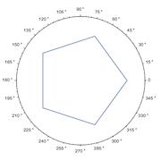
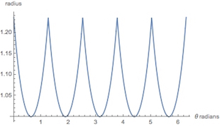

--- 
title: Fourier Analysis Algorithm for Identifying Shapes
author: Sammy Moseley
date: December 12th, 2016
header-includes: 
    - \usepackage{natbib}
    - \usepackage{graphicx}
    - \usepackage{subfig}
    - \usepackage{amsmath}
    - \usepackage{float}
    - \usepackage{mathrsfs}

output:
  pdf_document:
    md_extensions: +simple_tables

md_extensions: +simple_tables+raw_tex+implicit_header_references+raw_html+header_attributes+auto_identifiers

bibliography: Bibliography.bib
--- 
<!--Markdown Plugin https://github.com/naokazuterada/MarkdownTOC#manipulation-of-auto-link-ids -->

<!-- MarkdownTOC autolink="false" autoanchor="false" style="ordered", depth="1"-->

1. Introduction
1. Benchmark Hu Moment Algorithm
1. Fourier Analysis Algorithm
1. Algorithm Testing
1. Conclusion
1. Appendix A - Auxiliary Algorithms

<!-- /MarkdownTOC -->

# Introduction

Object detection is vital for unmanned aerial vehicles (UAVs) and driverless cars. However, the accuracy of object detection is decreased by high-speed, poor-quality imagery. High speed image capture is prone to pixelation, noise, blurring, and over/under exposure. Preprocessing can alleviate these problems, but one is limited by the amount of image data available, and as such cannot always reverse imaging errors. Since preprocessing cannot completely compensate for errors, it would be ideal to use a classification algorithm that is resilient to imaging errors. One such algorithm is a Fourier analysis algorithm to characterize the images.

Object detection is part of two larger computer science fields: computer vision and machine learning. These two fields were both born in the 1960s with major foundational developments taking place through the 1970s [@wiki_cv; @forbes_ml]. Typically, computer vision will start with image preprocessing and a segmentation algorithm. This will include trying to correct for any imaging errors, identifying the regions of interest, and then separating those regions from the rest of the image. To classify the regions of interest, one will often aim to use invariants. Invariants are formulated to be independent of certain image distortions, usually scale, while still being able to distinguish the image classes at hand. There are a number of popular invariants. Hu moments are a widely used - implemented in OpenCV, an open-source computer vision library. The feature vectors will then be either passed into a heuristics or machine learning algorithm to identify the object classification. In this paper, I will try to compare two proposed shape invariants: Fourier analysis and Hu moments.
  
\begin{figure}[H]
  \centering
      \includegraphics[width=1.3\textwidth]{46.jpg}
  \caption{Example Classification Target}
  \label{fig:shape}
\end{figure}

CUAir[^cua], an interdisciplinary team at Cornell University that designs, builds, and engineers a UAV, is trying to solve these computer visions difficulties. The team competes annually at AUVSI SUAS, an international competition in Maryland. The team's objectives include automatic takeoff, landing, egg drop, manual target recognition, and automatic target recognition (ATR). The ATR objective specifically relates to the computer vision problem that affects high-speed vehicles.

[^cua]: The author, Sammy Moseley, has been a member of the team since 2014 and has been working on their vision team, where he first started working on the computer vision problems the team tries to solve.

The ATR objective includes identifying seven characteristics of targets randomly place on the flight path: color of shape, color of alphanumeric alphanumeric, shape name, alphanumeric character, GPS location, and orientation (see fig. \ref{fig:shape}). Each ATR tasks' accuracy is degraded by poor image quality. This problem serves as a good means to compare a Hu moments algorithm, the benchmark, and a Fourier analysis algorithm.

The objective of this paper is to perform this comparison, Hu moments and Fourier analysis object detection algorithms. I will investigate whether a Fourier analysis algorithm is a feasible and an accurate method to identify shapes. To demonstrate these properties it is necessary to:  
1. Prove using the mathematical definitions of Fourier analysis that the Fourier analysis algorithm produces unique vectors for different shapes, and identical ones for equivalent shapes.
2. Illustrate with computational mathematics that under simulated real world conditions the Fourier analysis algorithm outperforms the benchmark Hu moment algorithm.

# Benchmark Hu Moment Algorithm

## Algorithm Overview
An overview of a Hu moment shape classification algorithm:  
1. Shape Thresholding : Binary thresholding  
2. Hu Moment Featuring : Create a feature vector from the 7 Hu moment invariants  
3. Machine Learning Classification : Train a k-nearest-neighbor model

### Shape Thresholding
Depending on the image characteristics, a simple binary thresholding algorithm could suffice to distinguish the image from the background. More complex thresholding ideas are elucidated in Appendix A.

### Hu Moment Featuring
Hu moments were chosen because they are well established method form of object recognition. Other moment invariants exist. However, one such alternative, Zernike moment invariants, shows not a significant improvement of accuracy, while being significantly more complex [@sabhara]. Hu moments (1962) are seven geometric moments that are rotation agnostic. From the moments, one can derive size agnostic invariants. 

### Machine Learning Classification {#hu-moment-knearest}
The K-nearest neighbor algorithm was selected because it classifies feature vectors easily and well. It was chosen over a Support Vector Machine (SVM) algorithm because it is usually performs better with small amounts of data than SVM [@raikwal].

# Fourier Analysis Algorithm

## Algorithm Overview

An overview of the Fourier transform contour shape classification algorithm:  
1. Shape Contouring : Given an region of interest, contour the shape  
2. Polar Conversion : The shape is mapped from Cartesian space to the polar coordinate system. It is important to note that the shapes must be expressible as a polar function - for a given angle, $\theta$, there must be only one point in the contour at radius, $r$.  
3. Resolution conversion: Re-sample the contour to get a constant sampling frequency  
4. Fourier Analysis : Using a DFT library, get the discrete wave forms for the shape.  
5. Machine Learning Classification : Train a k-nearest neighbor model  

### Shape Contouring
Depending on the image characteristics, a simple binary thresholding algorithm could suffice to distinguish the image from the background. More complex thresholding ideas are elucidated in Appendix A.

### Polar Conversion
Converting the shape can be done using simple conversion function from Cartesian to polar space:

$f:\mathbb{R}^2\rightarrow\mathbb{R}^2$, where $f[(x,y)]\mapsto(\arctan(\frac{y}{x}), \sqrt{x^2+y^2})$

When coding this on the computer, it is recommended to use arctan2 to get the correct angle for all quadrants and avoid division by 0 errors.

An example of contoured and polarized pentagon can be seen in Figure 1.

### Resolution Conversion
For most Discrete Fourier Transform (DFT) algorithms, it is necessary to have a constant frequency sampling rate, therefore, one should decimate[^dec] and interpolate as necessary to have a constant sampling frequency for each contour and across contours. The target frequency should be optimized for the shape classes.

[^dec]: decrease resolution

### Fourier Analysis
A DFT is ideal for shape classification because it is size and orientation agnostic. One can take the polar coordinates from the pentagon from Figure 1 and graph their radius as a function to get Figure 2.

To show that the Fourier analysis frequency domain for one n-gon is always different from another k-gon for any n and k, we can first express the contour for the n-gon as the following equation: 
\begin{equation} \label{eq:gencontour}
r(\theta, n) = \sec(\theta-\lfloor \frac{\theta n}{2\pi}\rfloor \frac{2*\pi}{n} - \frac{\pi}{n})
\end{equation}
where n is the number of sides. Fourier analysis can then be applied to the contours' equations to get the discrete frequency domains for shapes.

\begin{figure}
\centering
\begin{tabular}{cc}
  \includegraphics[width=65mm]{DiscretePlots/3.png} &   \includegraphics[width=65mm]{DiscretePlots/4.png} \\
(a) triangle & (b) square \\[6pt]
 \includegraphics[width=65mm]{DiscretePlots/5.png} &   \includegraphics[width=65mm]{DiscretePlots/6.png} \\
(c) pentagon & (d) hexagon \\[6pt]
\end{tabular}
\caption{Fourier Transform Frequency Domain}
\label{fig:shapefts}
\end{figure}

One may notice how the the frequency domain for an n-gon includes only frequencies that are multiples of n (fig. \ref{fig:shapefts}). To show this formally, one can express the general contour equation (eq. \ref{eq:gencontour}) as a sum of continuous functions in order to calculate the Fourier series.

\begin{equation} \label{eq:ftcof}
\begin{aligned}
a_{k,n} &= \frac{1}{\pi}\sum_{i=0}^{n-1}\int_{\frac{2\pi i}{n}}^{\frac{2\pi(i+1)}{n}} \sec(\theta - \frac{2\pi i}{n} - \pi n ) \cos(k\theta)d\theta \\
b_{k,n} &= \frac{1}{\pi}\sum_{i=0}^{n-1}\int_{\frac{2\pi i}{n}}^{\frac{2\pi(i+1)}{n}} \sec(\theta - \frac{2\pi i}{n} - \pi n ) \sin(k\theta)d\theta \\
m_{k,n} &= \sqrt{a_{k,n}^2 + b_{k,n}^2} \\
\end{aligned}
\end{equation}

where $a_{k,n}, b_{k,n}$ is the $k$ th $\cos, \sin$ term for the Fourier series describing the contour function for a $n$-gon. To prove that the Fourier frequency domain does not include frequencies which are not divisible by the number of sides $n$, let us define rotational symmetry,
\begin{equation} \label{eq:rotsym}
\centering
r\left(\theta, n\right) = r\left(\theta + \frac{2\pi}{n}, n \right)
\end{equation}

and reflectional symmetry,
\begin{equation} \label{eq:refsym}
\centering
r\left(\theta, n\right) = r\left(-\theta, n \right)
\end{equation}

All terms of the the Fourier series that have frequencies divisible by $n$ satisfy the properties defined by the above equations. Individual terms of the Fourier series that would have frequencies not divisible by $n$ would not satisfy the above properties, however, it is not clear that a linear combination of them would not satisfy the above equations. Define the following notation $\hat{a}_{k,n}$ is the variable that has value $a_{k,n}$. Each variable is only equal to itself, ore more formally: $\hat{a}_{p,q}=\hat{a}_{x,y} \iff p=q \wedge q=y$. Define the evaluation function $\mathscr{E}\left(\hat{v}_{a,b}\right) = v_{a,b}$, takes a variable and returns it's value.

Also, let's define the two following sets:
\begin{equation} \label{eq:setdef}
\begin{aligned}
\centering
C_n &= \{\hat{a}_{k,n} : \mathscr{E}\left(\hat{a}_{k,n}\right) \ne 0 \wedge n\nmid k \}\\
D_n &= \{\hat{b}_{k,n} : \mathscr{E}\left(\hat{b}_{k,n}\right) \ne 0 \wedge n\nmid k \}
\end{aligned}
\end{equation}

$C_n$ and $D_n$ contain the variables for the frequencies in the frequency domain that are not divisible by $n$. To show that $C_n,D_n=\emptyset$ we will use proof by induction.

**Base Case**: $\left\vert{C_n \cup D_n}\right\vert \ne 1$
Proof by contradiction: Assume $\left\vert{C_n \cup D_n}\right\vert = 1$
Let's call the one element in one of the sets $\hat{p}_{k,n}$. To maintain the properties described by equation \ref{eq:refsym}, $p_{k,n}sin\left(k\theta\right)=p_{k,n}sin\left(-k\theta\right)$, $sin$ is odd, so this is not true for all $\theta$, therefore $\hat{p}_{k,n}\notin D_{n}$.
If $\hat{p}_{k,n}\in C_{n}$ then $\hat{p}_{k,n}$ would satisfy equation \ref{eq:refsym}, however, it would not satisfy equation \ref{eq:rotsym}: $p_{k,n}\cos\left(k\theta\right) = p_{k,n}\cos\left(\frac{2\pi}{n}+k\theta\right)$. This is also not the case since $\frac{2\pi}{n}$ is not is a multiple of the terms period $\frac{2\pi}{k}$ as $n\mid k$ (eq \ref{eq:setref}).

**Inductive Step**: Assume $\left\vert{C_n \cup D_n}\right\vert$ cannot equal $p$, show that $\left\vert{C_n \cup D_n}\right\vert$ cannot equal $p+1$
Proof by contradiction: Assume that there exists a $\hat{p}_{k,n}$ not in $C_n\cup D_n$ that can be added to $D_n$ of the sets so that the Fourier series now satisfies the rotational symmetry outlined by outlined by equation \ref{eq:rotsym},
\begin{equation} \label{eq:hihi1}
\begin{aligned}
\sum_{\hat{a}_{j,n}\in C_n} \mathscr{E}\left(\hat{a}_{j,n}\right)\cos\left(0\right) & + \\ \sum_{\hat{b}_{j,n}\in D_n} \mathscr{E}\left(\hat{b}_{j,n}\right)\sin\left(0\right) + p_{k,n}\sin\left(0\right) &=\\ & \sum_{\hat{a}_{j,n}\in C_n}\mathscr{E}\left(\hat{a}_{j,n}\right)\cos\left(\frac{2\pi j}{n}\right) + \sum_{\hat{b}_{j,n}\in D_n}\mathscr{E}\left(\hat{b}_{j,n}\right)\sin\left(\frac{2\pi j}{n}\right) + \\ & p_{k,n}\sin\left(\frac{2\pi k}{n}\right)\\
\sum_{\hat{a}_{j,n}\in C_n} \mathscr{E}\left(\hat{a}_{j,n}\right) &= \sum_{\hat{a}_{j,n}\in C_n}\mathscr{E}\left(\hat{a}_{j,n}\right)\cos\left(\frac{2\pi j}{n}\right) + \sum_{\hat{b}_{j,n}\in D_n}\mathscr{E}\left(\hat{b}_{j,n}\right)\sin\left(\frac{2\pi j}{n}\right) + \\ & p_{k,n}\sin\left(\frac{2\pi k}{n}\right)\\
\end{aligned}
\end{equation}

,and symmetrical symmetry outlined by equation and \ref{eq:refsysm},
\begin{equation} \label{eq:hihi2}
\begin{aligned}
\sum_{\hat{a}_{j,n}\in C_n} \mathscr{E}\left(\hat{a}_{j,n}\right) &= \sum_{\hat{a}_{j,n}\in C_n}\mathscr{E}\left(\hat{a}_{j,n}\right)\cos\left(-\frac{2\pi j}{n}\right) + \sum_{\hat{b}_{j,n}\in D_n}\mathscr{E}\left(\hat{b}_{j,n}\right)\sin\left(-\frac{2\pi j}{n}\right) + p_{k,n}\sin\left(-\frac{2\pi k}{n}\right)\\
\end{aligned}
\end{equation}

Subtracting equation \ref{eq:hihi2} from equation \ref{eq:hihi1} you:
\begin{equation*}
\begin{aligned}
0 &= 2\sum_{\hat{b}_{j,n}\in D_n}\mathscr{E}\left(\hat{b}_{j,n}\right)\sin\left(-\frac{2\pi j}{n}\right) + 2p_{k,n}\sin\left(-\frac{2\pi k}{n}\right)\\
\end{aligned}
\end{equation*}
\begin{equation}
\begin{aligned}
p_{k,n}\sin\left(-\frac{2\pi k}{n}\right) &= \sum_{\hat{b}_{k,n}\in D_n}\mathscr{E}\left(\hat{b}_{k,n}\right)\sin\left(-\frac{2\pi k}{n}\right) \\
\end{aligned}
\end{equation}

This is a contradiction, sine waves of different frequencies are orthogonally perpendicular, so it is not possible to have $\hat{p}_{k,n}$ in $D_n$. Under the assumption that $\hat{p}_{k,n}$ could be in $C_n$, we follow similar steps. The Fourier series must satisfy rotational symmetry outlined by outlined by equation \ref{eq:rotsym},
\begin{equation} \label{eq:hihi1}
\begin{aligned}
\sum_{\hat{a}_{k,n}\in C_n} \mathscr{E}\left(\hat{a}_{k,n}\right)\cos\left(0\right) + &\\ \sum_{\hat{b}_{k,n}\in D_n} \mathscr{E}\left(\hat{b}_{k,n}\right)\sin\left(0\right) + p_{k,n}\cos\left(0\right) &=\\ & \sum_{\hat{a}_{k,n}\in C_n}\mathscr{E}\left(\hat{a}_{k,n}\right)\cos\left(\frac{\theta + 2\pi k}{n}\right) + \sum_{\hat{b}_{k,n}\in D_n}\mathscr{E}\left(\hat{b}_{k,n}\right)\sin\left(\theta + \frac{2\pi k}{n}\right) + \\ & p_{k,n}\cos\left(\theta + \frac{2\pi k}{n}\right)\\
\sum_{\hat{a}_{k,n}\in C_n} \mathscr{E}\left(\hat{a}_{k,n}\right) + p_{k,n} &= \sum_{\hat{a}_{k,n}\in C_n}\mathscr{E}\left(\hat{a}_{k,n}\right)\cos\left(\theta + \frac{2\pi k}{n}\right) + \sum_{\hat{b}_{k,n}\in D_n}\mathscr{E}\left(\hat{b}_{k,n}\right)\sin\left(\theta +  \frac{2\pi k}{n}\right) + \\ & p_{k,n}\cos\left(\theta + \frac{2\pi k}{n}\right)\\
\end{aligned}
\end{equation}

,and symmetrical symmetry outlined by equation and \ref{eq:refsysm},
\begin{equation} \label{eq:hihi2}
\begin{aligned}
\sum_{\hat{a}_{k,n}\in C_n} \mathscr{E}\left(\hat{a}_{k,n}\right) + p_{k,n} &= \sum_{\hat{a}_{k,n}\in C_n}\mathscr{E}\left(\hat{a}_{k,n}\right)\cos\left(-\theta - \frac{2\pi k}{n}\right) + \sum_{\hat{b}_{k,n}\in D_n}\mathscr{E}\left(\hat{b}_{k,n}\right)\sin\left(-\theta  - \frac{2\pi k}{n}\right) + \\ & p_{k,n}\cos\left(-\theta - \frac{2\pi k}{n}\right)\\
\end{aligned}
\end{equation}

Add equation \ref{eq:hihi2} from equation \ref{eq:hihi1},
\begin{equation*}
\begin{aligned}
2 \sum_{\hat{a}_{k,n}\in C_n} \mathscr{E}\left(\hat{a}_{k,n}\right) + 2p_{k,n} &= 2 \sum_{\hat{a}_{k,n}\in C_n}\mathscr{E}\left(\hat{a}_{k,n}\right)\cos\left(\theta + \frac{2\pi k}{n}\right) + 2p_{k,n}\cos\left(\theta + \frac{2\pi k}{n}\right)\\
\frac{d}{d\theta}\Bigg(2 \sum_{\hat{a}_{k,n}\in C_n} \mathscr{E}\left(\hat{a}_{k,n}\right) + 2p_{k,n} &= 2 \sum_{\hat{a}_{k,n}\in C_n}\mathscr{E}\left(\hat{a}_{k,n}\right)\cos\left(\theta + \frac{2\pi k}{n}\right) + 2p_{k,n}\cos\left(\theta + \frac{2\pi k}{n}\right)\Bigg)\\
0 &= -2 \sum_{\hat{a}_{k,n}\in C_n}\mathscr{E}\left(\hat{a}_{k,n}\right)\sin\left(\theta + \frac{2\pi k}{n}\right) -2p_{k,n}\sin\left(k\theta + \frac{2\pi k}{n}\right)
\end{aligned}
\end{equation*}
\begin{equation}
\begin{aligned}
p_{k,n}\sin\left(k\theta + \frac{2\pi k}{n}\right) &= -\sum_{\hat{a}_{j,n}\in C_n}\mathscr{E}\left(\hat{a}_{j,n}\right)\sin\left(j\theta + \frac{2\pi j}{n}\right)
\end{aligned}
\end{equation}
This is a contradiction, $\sin$ waves of different frequency are orthogonally perpendicular ($k\neq j$), so it is not possible to have $\hat{p}_{k,n}$ in $D_n$.

Every shape has a unique wave form. Some are radially symmetrical with different periodicity - a square is radially symmetrical at $2\pi/4$ vs a pentagon at $2\pi/5$. The impact of the proof says that their Fourier series will have different frequency domains since they have different radial symmetry. For two different shapes that have the same radial symmetry, they will have the same frequency domain, but different magnitudes for Fourier domains.

A unique Fourier Analysis frequency domain increases the robustness of the our algorithm. Random perturbations in the contour are less likely to cause the frequency domain to change so significantly that Fourier frequency domain vectors would be incorrectly classified.

### K-Nearest Neighbor
[See the K-Nearest Neighbor for Hu Moment][hu-moment-knearest]

# Algorithm Testing
To evaluate the efficacy of the Fourier Analysis algorithm, accuracy of the algorithm was benchmarked against the Hu moments algorithm with the addition of random contour perturbations. When deciding on a good metric to compare the algorithms, real world conditions was the primary criteria. When segmenting a pixelated or blurry shape from its background, it is common for the contour to be extruded or intruded due to thresholding or contouring systemic errors. To simulate the perturbations, contour points were randomly extruded or intruded with a normal distribution random variable.

\begin{figure}[H]
  \centering
      \includegraphics[width=1.3\textwidth]{PerturbationDensity.jpg}
  \caption{Shape Form Distribution}
  \label{fig:pertdens}
\end{figure}

Figure \ref{fig:pertdens} is a probability density for the shape form (filled in contour). Columns correspond to shapes and rows correspond to the standard deviation of the random variable used to cause perturbations in the contour. This graphic's purpose is to provide an intuitive understanding of how values of $\sigma$ correspond visually to the possible contours.

### Random Perturbation
Tests were performed for 6 polygons with increasing amounts of simulated contouring inaccuracy. Both tests were performed using a MatLab script and run on amazon webservers. 10,000 tests/shape were performed for the Fourier analysis algorithm, and 50,000 tests/shape for the Hu moments algorithm. Test numbers were chosen to observe convergence with the data. 

\begin{figure}[H]
  \centering
      \includegraphics[height=7cm,keepaspectratio]{RandomDistortions/RandomDistortions.jpg}
  \caption{Fourier Analysis Algorithm Results}
  \label{fig:faalg}
\end{figure}

\begin{figure}[H]
  \centering
      \includegraphics[height=9cm,keepaspectratio]{RandomDistortionsHu/HuMomentPerturbation.jpg}
  \caption{Hu Moments Algorithm Results}
  \label{fig:hualg}
\end{figure}

The accuracy of both algorithms decrease as the standard deviation of contour perturbation increases, however the Fourier analysis algorithm was more resilient than the Hu moment algorithm. Both algorithms tended to falsely identify shapes as triangles as the magnitude of inaccuracy increased.

# Conclusion

The Fourier analysis algorithm was shown to handle contouring errors better than a Hu moments algorithm. Random contouring perturbations were less likely to cause incorrect classification with the Fourier analysis algorithm. The tests should serve as a good prediction of how the algorithms would perform in the real world, however, there were not comprehensive. Further testing on real world data and more specific error simulation should provide greater certainty to how the algorithms compare.

While the Fourier analysis algorithm is more resilient than the Hu moments algorithm, it is still vulnerable to segmentation errors. Reducing errors in image contouring would alleviate this issue, however, to further increase resilience one can add safeguards implemented within the Fourier analysis algorithm. Possible other ways to strengthen the algorithm:   
* Train the model more specifically for shapes by having it consider the lowest frequencies as the most important
* Try performing some type of radial blurring to get rid of contouring noise
* Often contour perturbations will only occur on one side of the shape, try to identify which side and correct with the other side of the shape
* Use the Hu Moments algorithm verify the Fourier analysis algorithm's result, and, if conflict, resort to a third, perhaps less optimal, algorithm 

Some weaknesses of the algorithm include its inability to work on shapes which cannot be defined by a polar function and its inability to identify more complex shapes where there might not be a strict contour (Hu moments are better suited for this).

# Appendix A - Auxiliary Algorithms

For more challenging images, it may be necessary to convert the image into the Hue Saturation Value (HSV) color space and perform more complex thresholding algorithm variants, for example window thresholding and color space distance calculation in the cylindrical coordinate system.

A window thresholding algorithm compares pixel values against a moving average with dimensions $n\times m$. One should choose dimensions larger than the target, but ideally smaller than other features, such as forests or runways to avoid bad identifications.

For further contouring accuracy, one can use the HSV color space. The Red-Green-Blue (RGB) color space is a difficult color space to work in since the Cartesian distance between colors in the RGB space is not always representative of how different the colors actually. HSV solves this by providing just one dimension, Hue, representing color, and two dimension representing saturation and value (brightness).

